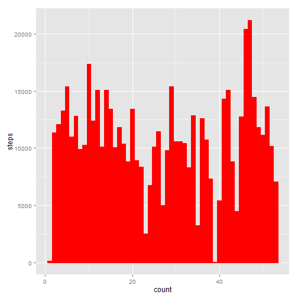
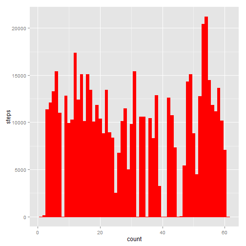

#data without missing value


mean total number of steps taken per day

```r
library(ggplot2)
data1<-read.csv("activity.csv");
data<-data1;
complete<-data1[complete.cases(data1),];

histo<-aggregate(list(complete$steps),list(complete$date),mean,data=complete);
histo<-cbind(histo,1:nrow(histo))

names(histo)<-c("date","steps","count");
plot_1<-ggplot(histo,aes(count,steps));
plot_1<-plot_1+ geom_bar(stat="identity",colour="red",fill="red");
plot_1;
```

 

```r
mean_number = mean(histo$steps)
median_number = median(histo$steps)
print("mean: ");print(mean_number)
```

```
## [1] "mean: "
```

```
## [1] 37.38
```

```r
print("media: ");print(median_number)
```

```
## [1] "media: "
```

```
## [1] 37.38
```


average daily activity pattern

```r
series<-aggregate(complete$steps,list(complete$interval),mean)
names(series)<-c("interval","steps")
plot_2 <- ggplot(series,aes(interval,steps))
plot_2+geom_line()
```

 


number of NAs

```r
nrow(data)-sum(complete.cases(data))
```

```
## [1] 2304
```

#The data with Nas replaced by ZERO

```r
data1<-read.csv("activity.csv")
log<-complete.cases(data1)
data1[!log,"steps"]<-0
complete<-data1[complete.cases(data1),];

histo<-aggregate(list(complete$steps),list(complete$date),mean,data=complete);
histo<-cbind(histo,1:nrow(histo))

names(histo)<-c("date","steps","count");
plot_1<-ggplot(histo,aes(count,steps));
plot_1<-plot_1+ geom_bar(stat="identity",colour="red",fill="red");
plot_1;
```

 

```r
mean_number = mean(histo$steps)
median_number = median(histo$steps)
print("mean: ");print(mean_number)
```

```
## [1] "mean: "
```

```
## [1] 32.48
```

```r
print("media: ");print(median_number)
```

```
## [1] "media: "
```

```
## [1] 36.09
```

```r
series<-aggregate(complete$steps,list(complete$interval),mean)
names(series)<-c("interval","steps")
plot_2 <- ggplot(series,aes(interval,steps))
plot_2+geom_line()
```

 
#conclusion: of course, ZEROS lower the mean so the plots are changed. But the shape of the series doesn't change and just be shorter.


```r
data1<-read.csv("activity.csv");
data<-data1;
complete<-data1[complete.cases(data1),];
#for chinese
NANANA
```

```
## [1] NA
```

```r
NANANA
```

```
## [1] NA
```

```r
#for english

#log_weekdays<-week_list =="Thursday" | week_list =="Wednesday" | week_lis=="Tuesday" | week_list =="Monday" | week_list =="Friday"

temp<-rep("weekends",nrow(complete))
temp[log_weekdays]<-"weekday"
new<-cbind(temp,complete)

plot_5_data<-aggregate(new$steps,list(new$temp,new$interval),mean)
names(plot_5_data)<-c("temp","interval","steps")
qplot(interval,steps,data=plot_5_data,facets=.~temp,geom = c("line"))
```

 


